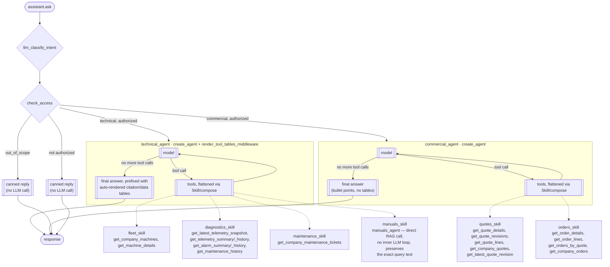

## Architecture


*(This image predates the skills-based shape described below and has no editable
source in this repo to regenerate it from — treat the diagram and text below as the
source of truth until it's redrawn.)*

```
src.assistant.ask(question, user_id, machine_id, history=None)   <- also served as POST /chat (src/server.py)
      |
      v
 build_graph (LangGraph StateGraph)
      |
      v
 llm_classify_intent            <- LLM router: classifies the request as technical / commercial / out_of_scope
      |
      v
 check_access                   <- gates the whole intent on the user's own visibility tier, before any
      |                            specialist agent runs (closes the gap where a model could otherwise
      |                            answer from hallucinated/history "knowledge" without calling a tool)
      |
      +--> technical_agent (create_agent)   <- composed from fleet/diagnostics/maintenance/manuals skills
      |
      +--> commercial_agent (create_agent)  <- composed from quotes/orders skills
      |
      +--> out_of_scope                     <- canned "out of scope" reply, no LLM/tool call
      |
      +--> access_denied                    <- canned "no permission" reply, no LLM/tool call
      |
      v
 response
```

*(The HTTP entry point is a single `POST /chat` in `src/server.py`; the other entry points are
`src/run_in_terminal.py` and calling `src.assistant.ask` directly from Python.)*

Both `technical_agent` and `commercial_agent` are a single `create_agent` each, composed
from reusable **skills** (`src/skills/`) rather than one hand-written prompt string and a
flat tool list — there's no separate "supervisor" layer, and no nested sub-agents:



## Assistant entry points

`src/assistant.py` exposes `ask` (returns the answer text) and `run` (returns the full graph
state). Both wrap the graph built by `build_graph` (`src/graph.py`), which is constructed once
per process on first use (`get_graph`, model from `LLAMA_MODEL` / `LLAMA_BASE_URL`): an LLM
router (`llm_classify_intent`) that classifies each request, an access gate (`check_access`),
and dispatch to exactly one branch — `technical_agent`, `commercial_agent`, `out_of_scope`, or
`access_denied` — then straight to `END`. There's no supervisor/handoff loop between branches;
each request is routed once.

`ask`/`run` take an optional `history` argument (a list of
`{"role": "user" | "assistant", "content": str}` dicts, oldest first), prepended as
`HumanMessage`/`AIMessage` turns before the current question. Every call uses a fresh
`thread_id` on the shared `InMemorySaver`, so the checkpointer never carries memory across
requests — the caller is expected to persist and re-supply `history` itself.

`src/server.py` serves this over HTTP with a single endpoint:

```
POST /chat
{"question": "...", "user_id": "USR-007", "machine_id": "MCH-0008",
 "history": [{"role": "user", "content": "..."}, {"role": "assistant", "content": "..."}]}
-> {"answer": "..."}
```

Run it with `uvicorn src.server:app --port 8001`. There is no authentication on it yet, so it
must only be reachable from trusted services (in docker compose it is not published to the host).

### Skills (`src/skills/`)

A `Skill` (`src/skills/base.py`) is a named bundle: `instructions` (a prompt fragment)
and `tools` it owns, plus an optional `tool_renderers` map for table rendering (below).
`compose(base_prompt, skills)` concatenates every skill's `instructions` onto an agent's
base prompt and flattens their `tools` into one list — composition is **static**: every
skill passed to an agent is always active, there's no per-request skill selection.

- `technical_agent` (`src/agents/technical.py`) composes `fleet_skill`, `diagnostics_skill`,
  `maintenance_skill`, and `manuals_skill`.
- `commercial_agent` (`src/agents/commercial.py`) composes `quotes_skill` and `orders_skill`.

`manuals_skill`'s `manuals_agent` is a plain `@tool`, not a nested agent: the retrieval
stage must receive the user's question exactly as asked, so it calls
`get_manual_excerpts_for_company` directly instead of routing through an LLM tool-calling
loop that could rewrite/shorten the query. Because that's a direct function call rather
than a tool invoked through an agent's own tool-calling loop, `ToolRuntime` injection
doesn't fire on it — so `manuals_agent` authorizes the machine itself
(`authorized_company_for_machine`, `src/tools/manuals_tools.py`) before retrieval runs,
rather than relying on `get_manual_excerpts`'s own `ToolRuntime`-triggered check.

### Result tables (`technical_agent` only)

`render_tool_tables_middleware` (`src/skills/formatting.py`, an `after_agent` middleware)
scans whichever tools actually got called in a turn and prefixes the model's final answer
with deterministic markdown tables — a citation table (source/page) for `manuals_agent`,
data tables for diagnostics/maintenance tool calls — in a fixed presentation order
(citations, then data) regardless of which order the model called tools in. This exists
because the real example questions span anywhere from one to three skills in no fixed
combination, so there's no single output template that fits all of them; tables are
rendered from whatever was actually retrieved, not from a pre-guessed question category.
`commercial_agent` does **not** use this middleware — its prompt explicitly prefers
bullet points over tables for a customer-facing chat interface.

### Access control

`src/security/access.py` defines three independent checks against a user's own
`visibility` tier: `can_access_technical_data` (full/technician — telemetry, alarms,
maintenance tickets), `can_access_commercial_data` (full/commercial — quotes, orders),
and `can_access_machine_identity` (full/technician/commercial — machine identity and
manuals, visible to *every* tier per the spec). Every tool re-derives its own authorized
`company_id`/`machine_id` server-side from `ToolRuntime[AgentContext].context.user_id`
(a real DB lookup) — never from an LLM-supplied argument — returning the
`ACCESS_DENIED_OR_UNAVAILABLE` sentinel string on denial. `check_access` in `graph.py`
additionally gates the whole intent up front using the widest applicable check for that
intent, closing a blind spot the per-tool gates can't: a model answering from
hallucinated or conversation-history "knowledge" without calling any gated tool at all.

### Context-based defaults

`AgentContext(user_id, machine_id)` (`src/context.py`) is passed into the graph via
LangGraph's `context=` mechanism at `assistant.run` — a hard channel, never part of
checkpointed state and never LLM-visible or LLM-modifiable, read by tools via
`ToolRuntime.context`. `machine_id` is optional on every tool that takes one
(`resolve_machine_id`, `src/tools/fleet_directory.py`): it defaults to
`runtime.context.machine_id` when the model omits it, so the model only needs to supply
`machine_id` explicitly to ask about a *different* machine than the one already scoped to
the conversation — it no longer has to correctly retype the current one on every call. A
separate, LLM-visible `SystemMessage` (also built in `assistant.run`) tells the model
what the current `machine_id` is, purely so it can refer to "this machine" when
contrasting it with another — it is not what enforces correctness or authorization.

### Capped tool output

`get_telemetry_history`, `get_alarm_history`, `get_maintenance_history`, and
`get_company_maintenance_tickets` cap their result at 100 rows (`cap_rows`,
`src/tools/pagination.py`), returning `{"rows": [...], "truncated": bool,
"oldest_included_timestamp": ...}` so a truncated result is never silently mistaken for
complete data — the boundary timestamp can be passed as `until` to page further back.
`get_telemetry_summary`/`get_alarm_summary` return aggregated data (per-day/week
telemetry averages; alarms grouped by code and severity) instead of raw rows for
trend/pattern questions — an unbounded `get_telemetry_history` for one machine's 30-day
history measured at ~73K tokens in a single tool call before these existed.

To try it directly from a terminal instead of through the HTTP API:
```bash
python -m src.run_in_terminal --question "..." --user-id u1 --machine-id MCH-0001
```

`src/run_specialist_in_terminal.py` (bypasses the router to exercise a single
specialist/tool in isolation) is currently broken — a syntax error prevents the module
from even being imported, and it also references `make_iot_tool`/`make_orders_tool`/
`make_service_tool` factories that no longer exist in `src/agents`. The example commands
below assume it's been fixed.

INFO-level logs print each tool call as it happens.

## Status

- `manuals_agent` — real pgvector RAG over Postgres. PDFs under `data/manuals/` are
  chunked, embedded, and indexed eagerly by `index_all_manuals()`
  (`src/tools/manuals_tools.py`) when `python -m src.db.startup` runs, matched to
  machines by serial number; `get_manual_excerpts`/`get_manual_excerpts_for_company` are
  read-only queries against the already-indexed data. See
  [Testing the manuals agent](#testing-the-manuals-agent) below.
- `diagnostics_skill` — real Postgres (`telemetrysnapshots`, `alarms` tables), including
  the capped/aggregated tools above.
- `fleet_skill` — real Postgres (`machines`, `machinemodels`).
- `maintenance_skill` — real Postgres (`maintenancetickets`, optionally joined with
  `alarms`).
- `quotes_skill`/`orders_skill` (`commercial_agent`) — real Postgres (`quotes`,
  `quoterevisions`, `quotelines`, `orders`, `orderlines`), each tool authorized the same
  way as the technical-side tools.
- User→company/visibility mapping (`src/security/access.py`'s `get_user_context`) is a
  real Postgres lookup against the `users` table — no hardcoded mapping.
- `src/run_specialist_in_terminal.py` — currently broken (see above); needs its syntax
  error fixed and its `iot`/`service`/`orders` entries either removed or rebuilt before
  it can run again.