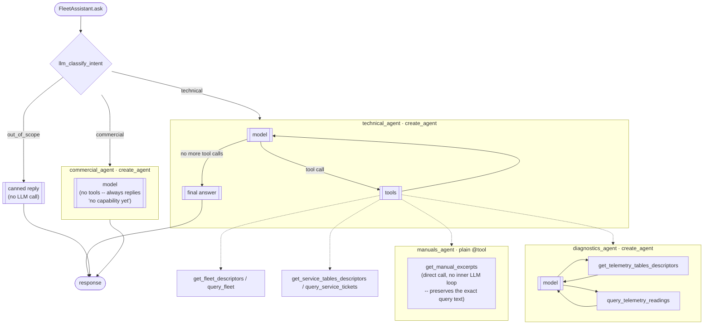

## Architecture


*(This image predates the router/`technical_agent`/`commercial_agent` shape described
below and has no editable source in this repo to regenerate it from — treat the diagram
and text below as the source of truth until it's redrawn.)*

```
FleetAssistant.ask(question, user_id, machine_id, history=None)
      |
      v
 build_graph (LangGraph StateGraph)
      |
      v
 llm_classify_intent            <- LLM router: classifies the request as technical / commercial / out_of_scope
      |
      +--> technical_agent (create_agent)   <- grounds its answer using manuals/diagnostics/fleet/service tools
      |
      +--> commercial_agent (create_agent)  <- currently a stub, no tools
      |
      +--> out_of_scope                     <- canned "out of scope" reply, no LLM/tool call
      |
      v
 response
```

*(There is no HTTP API in this repo. The AROL Customer Platform backend imports
`FleetAssistant` directly, in-process, via a git submodule at `backend/assistant/` — see the
root [README](../README.md#how-its-integrated). The entry points here are
`src/run_in_terminal.py`, `src/run_specialist_in_terminal.py`, and calling `FleetAssistant`
directly from Python.)*

`technical_agent` is a single `create_agent` whose tools are a mix of direct backend calls
and nested specialist agents — there's no separate "supervisor" layer above it:



## FleetAssistant

`FleetAssistant` is the entry point the backend integration above delegates to. It wraps
`build_graph` (`src/graph.py`): an LLM router (`llm_classify_intent`) that classifies each
request and dispatches to exactly one branch — `technical_agent`, `commercial_agent`, or a
canned `out_of_scope` reply — then goes straight to `END`. There's no supervisor/handoff
loop between branches; each request is routed once.

`FleetAssistant.run`/`.ask` take an optional `history` argument (a list of
`{"role": "user" | "assistant", "content": str}` dicts, oldest first), prepended as
`HumanMessage`/`AIMessage` turns before the current question in the `messages` list sent
into the graph. This is how multi-turn context reaches the router and agents — each
`FleetAssistant` instance builds its own fresh `InMemorySaver` checkpointer and random
`thread_id` on construction, so relying on the checkpointer for cross-request memory doesn't
work when a new instance is built per request (as the backend integration does); the caller
is expected to persist and re-supply history itself.

`technical_agent` (`src/agents/technical.py`) is where the real grounding happens: its
tools are `manuals_agent` (a plain `@tool`, calls `get_manual_excerpts` directly — real
pgvector RAG, see Status below), `diagnostics_agent` (its own nested `create_agent`
running a tool-calling loop against real telemetry/alarm data), and the fleet/service
tools (`get_fleet_descriptors`, `query_fleet`, `get_service_tables_descriptors`,
`query_service_tickets`) called directly, without a specialist wrapper of their own.
`commercial_agent` (`src/agents/commercial.py`) is a real graph node but currently a full
stub — no tools, its system prompt just says it has no capability yet.

`src/agents/orders.py` (`orders_agent`, real `create_agent` with `get_orders_info` /
`list_contracts` tools) exists and is exported from `src/agents/__init__.py`, but is
**not wired into `technical.py`, `commercial.py`, or `graph.py`** — it's currently only
reachable through the standalone `run_specialist_in_terminal.py` test harness, not through
the real `FleetAssistant` entry point.

Agents are plain functions (`make_x_tool(llm)` / `make_x_agent(llm, checkpointer)`), not
classes — `src/agents/` has one file per specialist, with no separate node/wrapper layer.

To try it directly from a terminal instead of through the (not yet implemented) HTTP API:
```bash
python -m src.run_in_terminal --question "..." --user-id u1 --machine-id MCH-0001
```
Or exercise a single specialist/tool in isolation, bypassing the router:
```bash
python -m src.run_specialist_in_terminal manuals --machine-id MCH-0001 --question "..."
```
INFO-level logs print each tool call as it happens.

## Status

- `manuals_agent` — real pgvector RAG over Postgres. PDFs under `data/manuals/` are
  chunked, embedded, and indexed eagerly by `index_all_manuals()`
  (`src/tools/manuals_tools.py`) when `python -m src.db.startup` runs, matched to
  machines by serial number; `get_manual_excerpts` is a read-only query against the
  already-indexed data. See [Testing the manuals agent](#testing-the-manuals-agent)
  below.
- `diagnostics_agent` — real Postgres (`telemetrysnapshots`, `alarms` tables).
- `get_fleet_descriptors` / `query_fleet` — real Postgres (`machines`, `machinemodels`).
- `get_service_tables_descriptors` / `query_service_tickets` / `open_new_ticket` — real
  Postgres (`maintenancetickets`).
- `orders_agent` — hardcoded mock data (`src/tools/orders_tools.py`), and not wired into
  the live graph (see above) — exists for local/terminal testing only.
- `commercial_agent` — stub, no backend, no tools.
- User↔company/visibility mapping (`src/tools/fleet_directory.py`'s `USER_TO_COMPANY` /
  `USER_VISIBILITY`) is still hardcoded, pending a real lookup — machine↔company/serial
  resolution (`machine_lookup`) already queries Postgres directly.

## Testing the manuals agent

Machine → company → manual reference (from the fleet dataset):

| machine_id | company_id | serial_number (manual) |
| --- | --- | --- |
| MCH-0001, MCH-0002, MCH-0003 | CMP-001 | 15610, 17203, 17579 |
| MCH-0004, MCH-0005 | CMP-003 | 17478, A4344 |
| MCH-0006 | CMP-004 | A2064 |
| MCH-0007, MCH-0008 | CMP-002 | A2055, A2132 |

`company_id` is no longer a caller-supplied argument anywhere in this flow — it's derived
server-side from `machine_id` (`machine_lookup` in `src/tools/fleet_directory.py`) — the
table above is just fleet reference data, not something you need to pass.

Example commands (after `python -m src.db.startup`, which now indexes all manuals up
front — no per-query indexing delay to wait through):

```bash
python -m src.run_specialist_in_terminal manuals --machine-id MCH-0004 --question "What does error E204 mean?"
```

```bash
python -m src.run_specialist_in_terminal manuals --machine-id MCH-0004 --question "What safety checks should I do before maintenance on this machine?"
```

```bash
python -m src.run_specialist_in_terminal manuals --machine-id MCH-0004 --question "What is the lubrication schedule for this machine?"
```

```bash
python -m src.run_specialist_in_terminal manuals --machine-id MCH-9999 --question "What does error E204 mean?"
```

```bash
python -m src.run_specialist_in_terminal manuals --machine-id MCH-0001 --question "How many closing heads does this machine have?"
```

```bash
python -m src.run_specialist_in_terminal manuals --machine-id MCH-0002 --question "How do I replace the compensating springs?"
```

```bash
python -m src.run_specialist_in_terminal manuals --machine-id MCH-0002 --question "What should I do before operating on the caps selection equipment?"
```

```bash
python -m src.run_specialist_in_terminal manuals --machine-id MCH-0007 --question "What lubricant should I use for this machine?"
```

```bash
python -m src.run_specialist_in_terminal manuals --machine-id MCH-0007 --question "How do I adjust the threading roller lateral load?"
```

```bash
python -m src.run_specialist_in_terminal manuals --machine-id MCH-0007 --question "How should this machine be scrapped or disposed of?"
```

Add `--show-retrieval` to any command to print the pgvector candidates and the chunks kept
after reranking, before the final result — useful for checking *why* an answer came out
the way it did.

### Real error codes present in the MCH-0004 (17478) manual

E204 does not exist in this manual — the first test above is a genuine negative case, not
a mistake. These do exist and should return a grounded, cited answer:

```bash
python -m src.run_specialist_in_terminal manuals --machine-id MCH-0004 --question "What does error E20 mean?" --show-retrieval
```

```bash
python -m src.run_specialist_in_terminal manuals --machine-id MCH-0004 --question "What does error E15 mean?"
```

```bash
python -m src.run_specialist_in_terminal manuals --machine-id MCH-0004 --question "What does error E11 mean?"
```

```bash
python -m src.run_specialist_in_terminal manuals --machine-id MCH-0004 --question "What does error E10 mean?"
```
