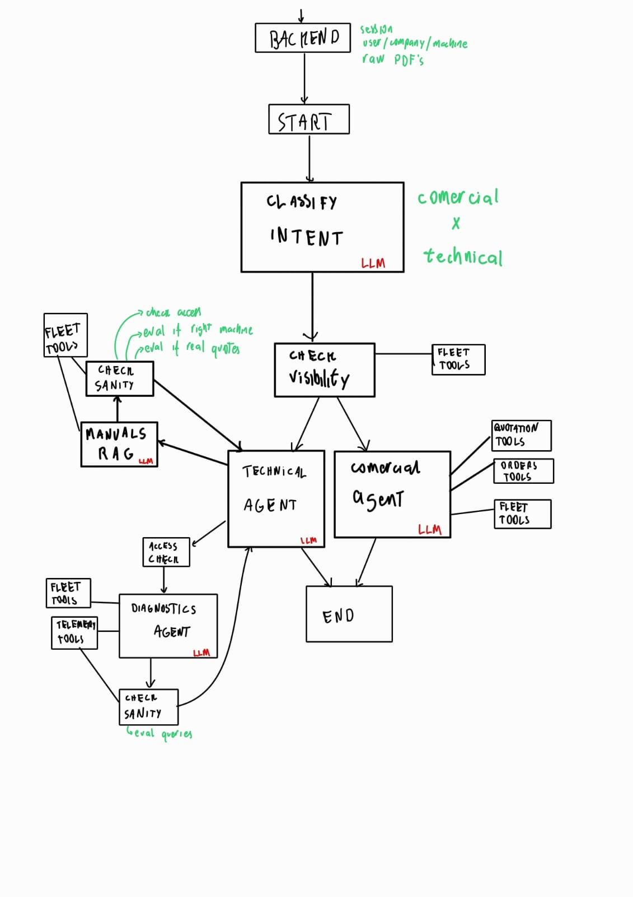
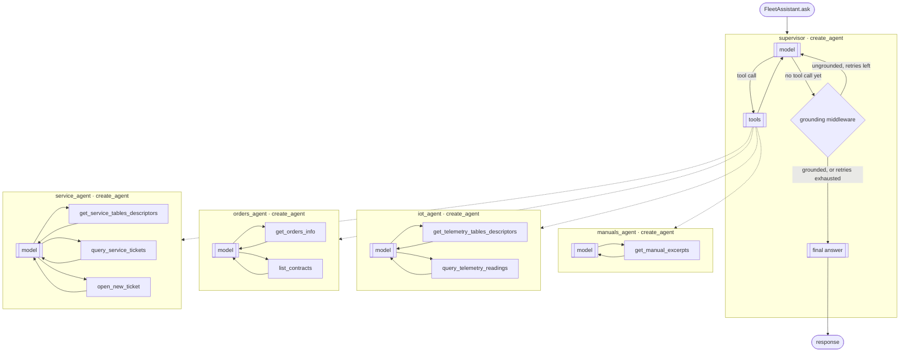

## Architecture





```
POST /orchestrate
      |
      v
 FleetAssistant.ask(question, user_id, machine_id)
      |
      v
 supervisor (create_agent)             <- decides which specialist(s) to call, and when it has enough to answer
      |
      v
 manuals_agent | iot_agent | orders_agent | service_agent   (called as tools, any number of times, any order)
      |
      v
 response returned to backend
```

Each specialist is itself a `create_agent`, wrapped as a single tool the supervisor can call — its own tool-calling loop runs against its own backend before it hands a grounded answer back up:



The `grounding middleware` matters because Ollama does not honor `tool_choice`: nothing at the model layer forces the supervisor to call a specialist before answering. The middleware runs after every supervisor model turn and, if it answered without calling any specialist tool since the user's last message, bounces it back with a reminder (capped retries, so it can't loop forever) instead of letting an ungrounded answer through.

## FleetAssistant

`FleetAssistant` is the entry point the API above delegates to. It wraps a single `supervisor` `create_agent`, whose tools are the four specialist agents (`manuals_agent` / `iot_agent` / `orders_agent` / `service_agent`) — each one its own `create_agent` grounding its answer via an Ollama tool-calling loop against a swappable backend (local placeholders today, real services/MCP later). The supervisor calls whichever specialists are relevant, in whatever order, however many times, and answers once it has grounded evidence — there's no separate routing or synthesis step.

Agents are plain functions (`make_x_tool(llm)` / `make_supervisor_agent(llm, checkpointer)`), not classes — `src/agents/` has one file per specialist plus `supervisor.py`, with no separate node/wrapper layer.

To try it directly from a terminal instead of through the FastAPI service:

INFO-level logs print each specialist tool call as it happens; use `--verbose` to also print the final plan and any recorded error.

## Status

`manuals_agent`, `iot_agent`, `orders_agent` and `service_agent` are wired end-to-end against local placeholder backends (in-memory manual corpus, telemetry log, order/contract log, ticket log) so the supervisor/specialist pattern and tool-calling loop can be validated before the real backends (RAG, MCP tool calls, ERP/CRM/IoT integrations) are implemented.
