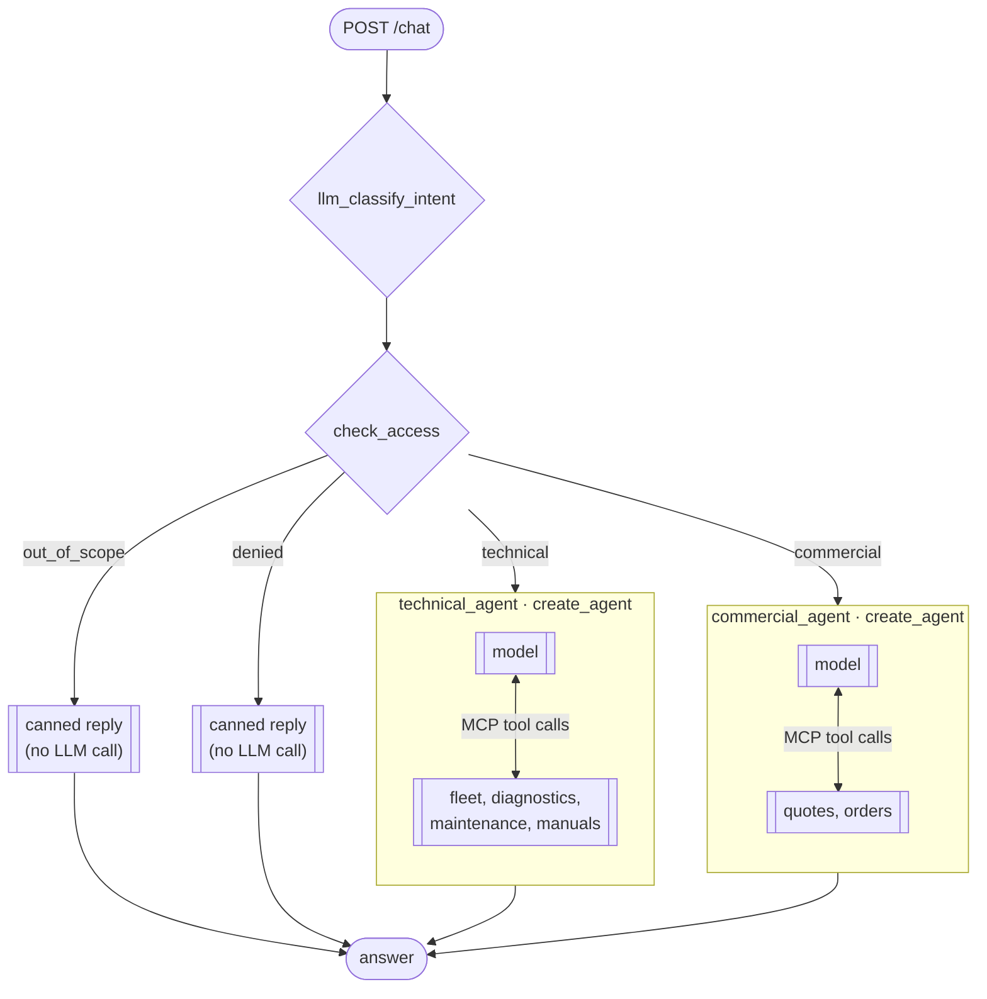

## Architecture

```
backend  ──POST /chat + user's JWT──▶  orchestrator  ──MCP tool calls + same JWT──▶  mcp-server  ──HTTP + same JWT──▶  api
                                        (LangGraph)                                   (tools, manuals RAG)               (data, access rules)
```

The orchestrator is stateless and has no database. The user's identity is a single JWT that travels the whole
chain, so the API's access rules (company, visibility tier) apply to every tool call exactly as they do for the
frontend.

### The graph



- `llm_classify_intent` classifies the request as technical, commercial or out of scope, using an escalating
  window of the conversation (1, 2, 4, then 8 messages) and widening only when the router says it can't resolve
  a back-reference.
- `check_access` denies a whole intent up front using the caller's visibility tier (sent by the backend). This
  is **defense-in-depth**: it stops the model answering a commercial question from conversation history without
  calling any tool. The real enforcement is the API's, per tool call.
- Each agent is a single `create_agent`, composed from **skills** (`src/skills/`): prompt instructions plus the
  names of the MCP tools they use. There are no nested agents and no supervisor loop; each request is routed once.

### Tools come from the MCP server

`src/mcp_client.py` connects to the MCP server, loads its tool list once (lazily, so the orchestrator can start
before the MCP server is ready), and hands each agent the tools its skills name. A skill naming a tool the
server doesn't have fails at graph build with a clear error.

The **user's token** rides in `AgentContext` (`src/context.py`), LangGraph's hard channel: never in graph state,
never visible to the model, never logged. A tool-call interceptor adds it as the `Authorization` header of
every MCP request. With no token, the call is refused before it leaves.

MCP tools return ready-to-read markdown, and report errors as text the model is told to relay plainly
(access denied, not found, service unavailable), never guess around.

| Agent | Skills | MCP tools |
| --- | --- | --- |
| technical | fleet, diagnostics, maintenance, manuals | `get_company_machines`, `get_machine_details`, `get_latest_telemetry_snapshot`, `get_telemetry_summary`, `get_telemetry_history`, `get_alarm_summary`, `get_alarm_history`, `get_maintenance_history`, `get_company_maintenance_tickets`, `get_manual_excerpts` |
| commercial | quotes, orders | `get_company_quotes`, `get_quote_details`, `get_quote_revisions`, `get_latest_quote_revision`, `get_quote_lines`, `get_orders_by_quote`, `get_company_orders`, `get_order_details`, `get_order_lines` |

### Entry points

`src/assistant.py` exposes `ask` (the answer text) and `run` (the full graph state). Both are `async` and take
`question, machine_id, visibility, token, history=None`. The graph is built once per process. Every call uses a
fresh checkpointer thread, so nothing is remembered between requests: the caller (the backend) persists the
conversation and re-supplies `history`.

`src/server.py` serves it over HTTP with one endpoint:

```
POST /chat        Authorization: Bearer <the end user's JWT>
{"question": "...", "machine_id": "MCH-0001", "visibility": "technician",
 "history": [{"role": "user", "content": "..."}, {"role": "assistant", "content": "..."}]}
-> {"answer": "..."}
```

`401` without a bearer token, `503` if the MCP server can't be reached. There is no other authentication yet, so
the service must only be reachable from trusted services (in docker compose it is not published to the host).

### Access control

| visibility | Machines, models, manuals | Telemetry, alarms, maintenance | Quotes and orders |
| --- | --- | --- | --- |
| `full` | yes | yes | yes |
| `technician` | yes | yes | no |
| `commercial` | yes | no | yes |

A user only ever reaches their own company's rows. Both checks are made by the API on every call; a request
outside the user's scope is declined explicitly, never answered from other data and never returned as empty.

`docs/TASK.md` is the original task description this project started from.
